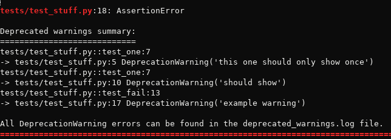

pytest capture DeprecatedWarnings
=================================

This is a pytest plugin to collect and print a summary of all
DeprecatedWarnings encountered during test execution and save them in a file.

Installation and usage
======================

Simply:

    pip install pytest-capture-deprecatedwarnings

And it will automatically be added to your pytest output.
